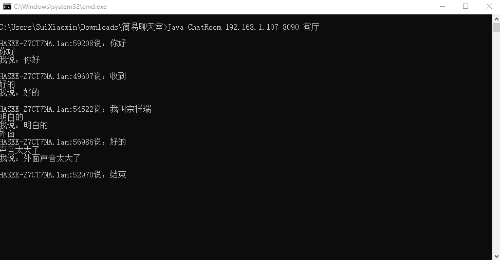
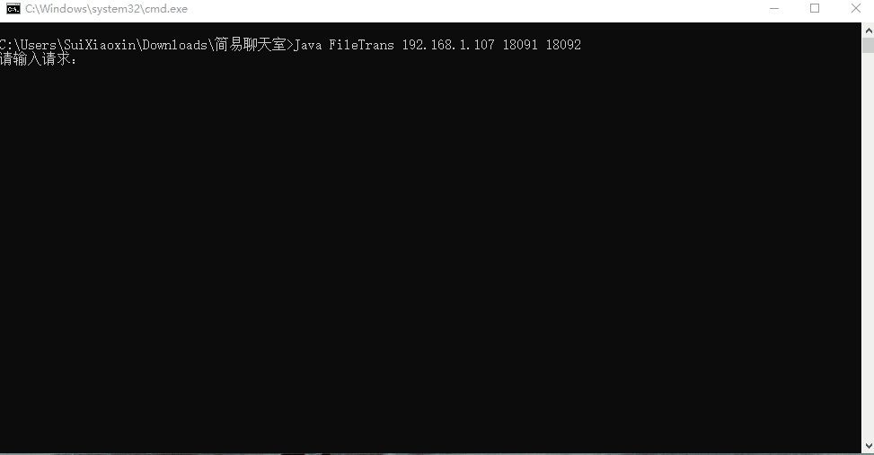

# Network-Chatroom
 网络聊天室
## 功能描述
该软件实现局域网聊天室的功能，通过UDP协议进行文字通信，通过TCP协议实现自助文件索取。使用该软件进行自主文件索取时，无需对端主动发送文件，需要什么文件自己去对方电脑中拿即可(当然前提是对端开启了服务)，具有极大的便利性，能够满足日常工作中一个人控制堕胎电脑的需求。由于在大型企业的局域网中，部分端口已经被关闭，所以可能无法使用windows自带的局域网共享，或linux的基于smb的文件传输，此时该软件就展现出了极大的优越性和便利性。同时，为了防止使用者不清楚对端电脑的目录结构，该软件还可以索取对端电脑的目录结构，以达到“要什么取什么”的效果。

## 截图
### 基于UDP的文字传输

### 基于TCP的文件传输

## 版本更新
### V1.0
1. 完成最基本的文件索取、文件传输和文字传输功能 
2. 使用UDP实现文字传输 
3. 使用TCP实现文件索取、目录结构索取 
4. 该版本为控制台展现形式，并没有加入GUI界面 